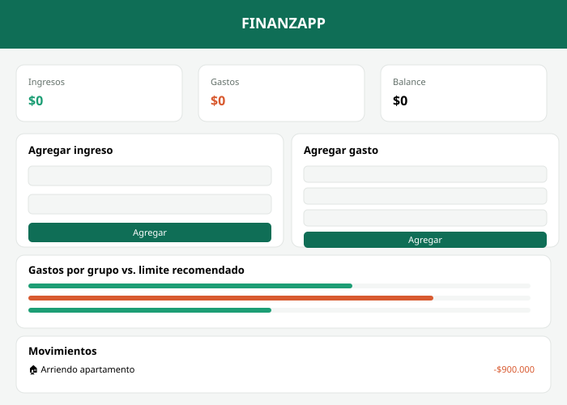

# FINANZAPP — Control de gastos personales

## Overview

FINANZAPP is a personal finance web application that helps users track their income and expenses. The app consumes a sample API (`data/datos.json`) using `fetch`, which contains the spending categories available in the app, each identified by an emoji. Once loaded, users can add new income sources and new expenses, assigning each expense to a category such as rent, food, transportation, debts, or entertainment. The app calculates totals in real time and compares spending against the 50/30/20 budgeting rule, showing progress bars and simple financial tips when a category exceeds its recommended limit. The interface handles three states while working with the data: a loading state shown while the fetch request is in progress, a data state that renders the full dashboard once the information is available, and an error state that appears if the request fails. All user-entered data is saved in the browser's localStorage, so it persists even after reloading the page.

## Mockup

La vista se distribuye así: encabezado con el nombre FINANZAPP y un logo minimalista, tres tarjetas de resumen (ingresos, gastos, balance), dos formularios lado a lado para agregar ingresos y gastos, una sección de barras de progreso comparando el gasto real contra los límites recomendados (regla 50/30/20), una sección de consejos financieros automáticos, y una lista de movimientos recientes con emoji por categoría y opción de eliminar cada uno.

## Cómo ejecutarlo

1. Clona este repositorio (o tu fork) en tu computador.
2. Abre la carpeta del proyecto con VS Code.
3. Como el proyecto usa `fetch` para leer un archivo local (`data/datos.json`), necesitas abrirlo con la extensión **Live Server** (clic derecho en `index.html` → "Open with Live Server"), no con doble clic directo.
4. La app carga las categorías desde el archivo de datos. Puedes agregar tus propios ingresos y gastos desde los formularios; estos se guardan automáticamente en el navegador (localStorage).

## Estructura del proyecto

FINANZAPP

    -> index.html
    -> css/
        styles.css
    -> js/
        app.js
    -> data/
        datos.json
    -> mockup.svg
    -> README.md

    
## Tecnologías usadas

- HTML5, CSS3, JavaScript (vanilla)
- `fetch()` para el consumo de datos
- `localStorage` para persistencia de datos del usuario

## Autor

Michael Adonis Pérez Triana — Ingeniería de Sistemas, CORHUILA.