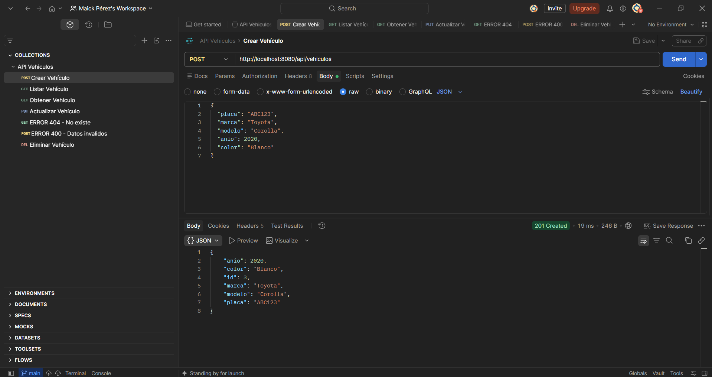
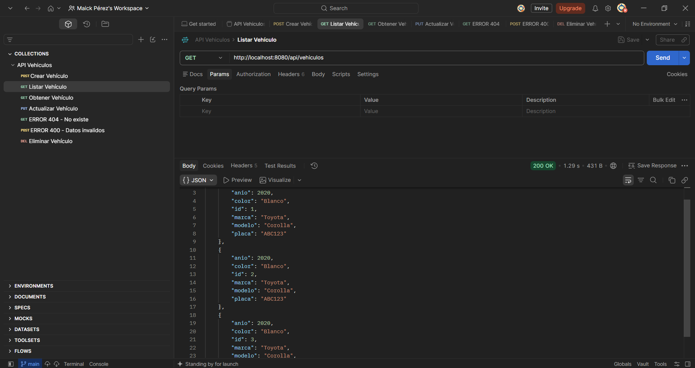
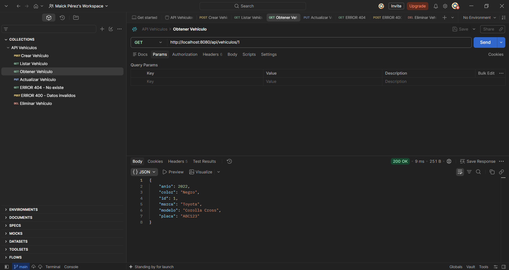
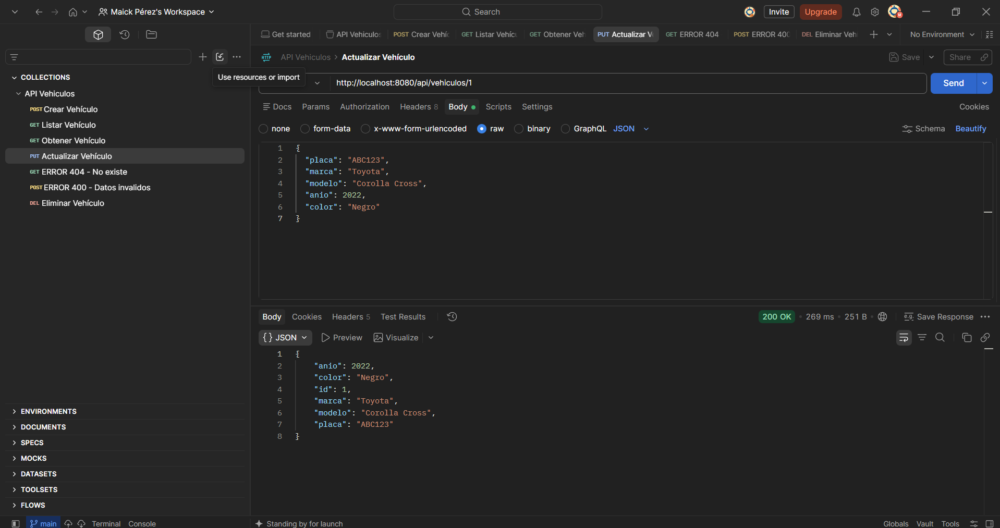
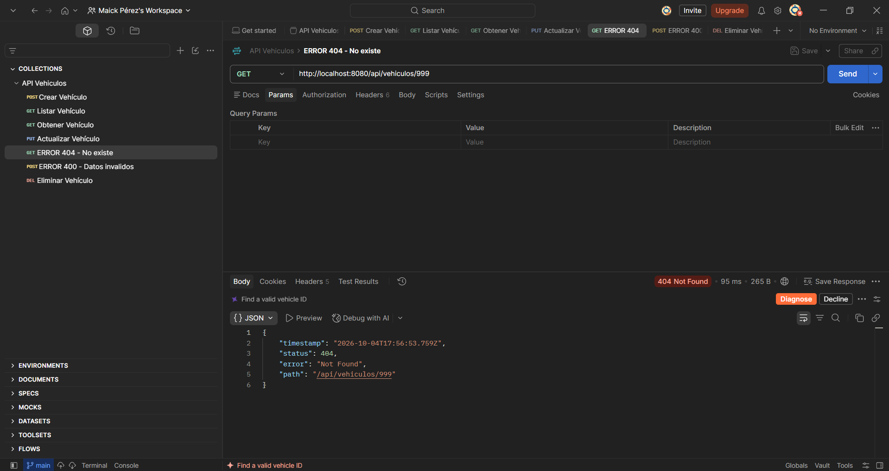
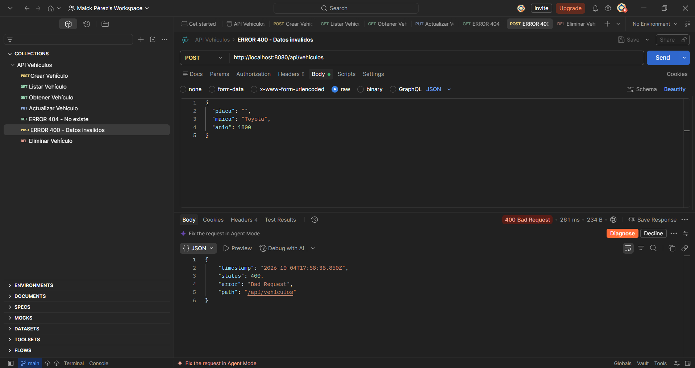
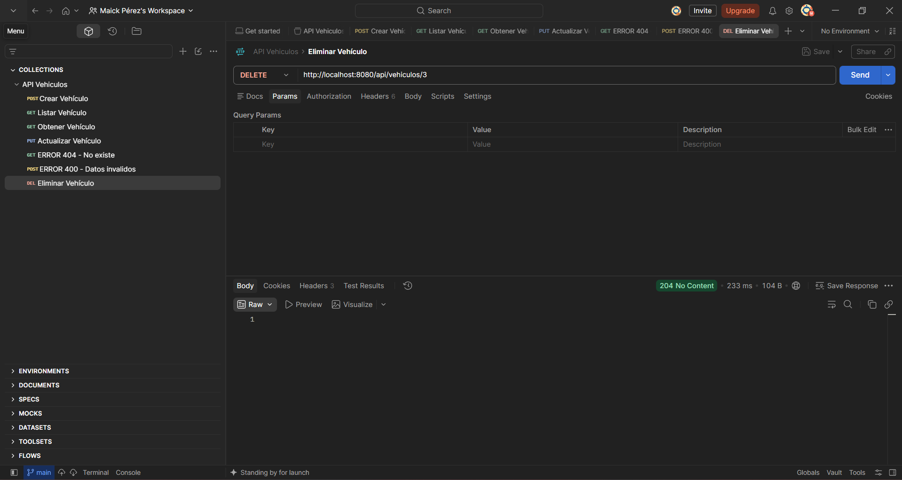

# API REST de Vehículos

API REST hecha con Spring Boot que permite administrar vehículos por placa, marca, modelo, año y color, además usa arquitectura en capas (entity, repository, controller y service) y guarda los datos con JPA en una base de datos H2 en memoria.

## Cómo ejecutar

**Requisitos:** Java 17 o superior.

**Comando** (desde la carpeta `api-vehiculos`):

```bash
./mvnw spring-boot:run
```

En Windows con PowerShell: `.\mvnw spring-boot:run`

La API queda disponible en `http://localhost:8080`.

**Swagger:** `http://localhost:8080/swagger-ui/index.html`

*Nota: la base H2 vive en memoria, así que los datos se borran al detener la aplicación.*

## Endpoints
| Método | Ruta | Descripción | Respuesta |
|---|---|---|---|
| GET | `/api/vehiculos` | Lista todos los vehículos | 200 |
| GET | `/api/vehiculos/{id}` | Obtiene un vehículo por su id | 200 / 404 |
| POST | `/api/vehiculos` | Crea un vehículo nuevo | 201 / 400 |
| PUT | `/api/vehiculos/{id}` | Actualiza un vehículo existente | 200 / 404 / 400 |
| DELETE | `/api/vehiculos/{id}` | Elimina un vehículo | 204 / 404 |

**Validaciones:** la placa y la marca son obligatorias, y el año debe ser 1900 o mayor.


## Pruebas con Postman


La colección de Postman está en la carpeta `postman/`. Estas son las pruebas de los cinco endpoints y los dos casos de error.

### 1. Crear vehículo (POST, 201)


### 2. Listar vehículos (GET, 200)


### 3. Obtener un vehículo (GET, 200)


### 4. Actualizar vehículo (PUT, 200)


### 5. Error 404: el vehículo no existe


### 6. Error 400: datos inválidos


### 7. Eliminar vehículo (DELETE, 204)


## API reference

This API manages a collection of vehicles. The `GET /api/vehiculos` endpoint returns the full list of vehicles stored in the database. The `GET /api/vehiculos/{id}` endpoint returns a single vehicle, or a 404 error if the id does not exist. The `POST /api/vehiculos` endpoint creates a new vehicle and returns status 201, and it returns a 400 error if the plate or the brand is empty or the year is below 1900. The `PUT /api/vehiculos/{id}` endpoint updates an existing vehicle with the data sent in the request body. The `DELETE /api/vehiculos/{id}` endpoint removes a vehicle and returns status 204 with no content.